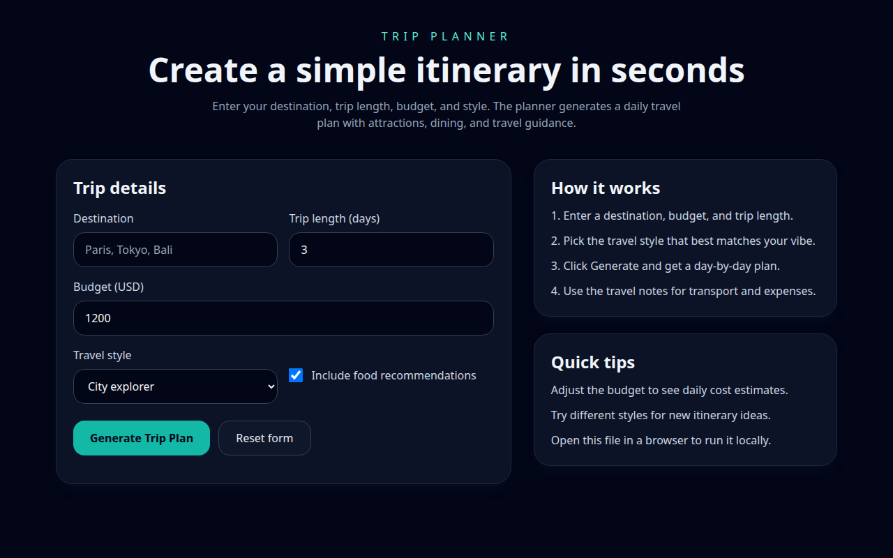

<p align="center">
  <h1 align="center">🗺️ Trip Planner</h1>
  <p align="center">
    <strong>Live, data-driven trip plans — powered by OpenStreetMap, Claude skills &amp; AI agents</strong>
  </p>
  <p align="center">
    <a href="https://trip-planner-mu-taupe.vercel.app">
      
    </a>
  </p>
</p>

---

<p align="center">
  
</p>

---

# Trip Planner

A trip planning app that uses the **OpenStreetMap MCP server**, a **trip-planner skill**, and three **agents** to generate live, data-driven trip plans from real map data.

## ✨ What is this?

Enter a destination, pick your travel style, and hit **Generate** — the backend calls the **OpenStreetMap MCP server**, runs a **Claude skill** with five planning rules, and pipelines the result through three **AI agents** (destination → budget → schedule). You get a complete day-by-day itinerary with real places, route times, and a budget breakdown — no hardcoded data.

## 🚀 Features

- 🔍 **Real map data** — geocoding, POI discovery, and route directions from OpenStreetMap via MCP
- 🧠 **AI skill pipeline** — five planning rules (budget, proximity, travel time, food, daily schedule)
- 🤖 **Three specialized agents** — `destination-agent`, `budget-agent`, `schedule`
- 🖥️ **Clean web UI** — responsive Tailwind CSS form, instant results
- 🛡️ **Graceful fallback** — curated sample data when the MCP server is unavailable
- 📄 **Slides included** — product intro in [`slides/pitch.md`](slides/pitch.md)

## Architecture

```
Browser (app.js)  →  POST /api/generate-itinerary  →  server.js (Express)
                                                       ├── MCP Client (JSON-RPC over stdio)
                                                       │   └── osm-mcp-server (uvx)
                                                       ├── Skill: trip-planner (5 rules)
                                                       └── Agents: destination → budget → schedule
```

## How it works

| Layer | File | Role |
|---|---|---|
| **Frontend** | `index.html` + `app.js` | Trip form UI (Tailwind), calls the backend API |
| **Backend** | `server.js` | Express API, MCP client, skill orchestrator, agent pipeline |
| **MCP server** | `.mcp.json` → `uvx osm-mcp-server` | OSM geocoding, POI search, route directions |
| **Skill** | `.claude/skills/trip-planner/skill.md` | 5 planning rules encoded in `tripPlannerSkill()` |
| **Agents** | `.claude/agents/*.md` | `destination-agent`, `budget-agent`, `schedule` |

## Files

```
trip_planner/
├── index.html          # Tailwind CSS UI
├── app.js              # Frontend logic, calls POST /api/generate-itinerary
├── server.js           # Express backend, MCP client, skill + agent orchestration
├── package.json        # Node.js dependencies (express)
├── .mcp.json           # MCP server config (osm-mcp-server via uvx)
├── .claude/
│   ├── skills/trip-planner/skill.md    # Skill: budget, proximity, travel, food, schedule
│   ├── agents/
│   │   ├── destination-agent.md        # Uses OSM MCP to find attractions & restaurants
│   │   ├── budget-agent.md             # Hotel / food / transportation breakdown
│   │   └── schedule.md                 # Day-by-day timeline with specific times
│   └── settings.local.json             # Enabled MCP servers
├── index.html          # Frontend UI (Tailwind CSS)
└── README.md
```

## Usage

1. Install dependencies:

   ```bash
   npm install
   ```

2. Start the server:

   ```bash
   node server.js
   ```

3. Open **http://localhost:3001** in a browser.

4. Enter a destination, number of days, budget, and travel style.

5. Click **Generate trip plan** — the backend calls the OSM MCP server, runs the skill pipeline, and returns a live trip plan with real places and route times.

## MCP tools used at runtime

| Tool | Used by | Purpose |
|---|---|---|
| `geocode_address` | destination-agent | Resolve destination name to lat/lon |
| `find_nearby_places` | destination-agent | Discover attractions, restaurants, POIs |
| `explore_area` | destination-agent | Backup POI discovery |
| `get_route_directions` | schedule-agent | Travel time and distance between daily stops |

## Skill rules (from skill.md)

1. Consider user's budget → budget breakdown (hotel 45% / food 30% / transport 15% / misc 10%)
2. Group nearby locations → POIs sorted by distance, clustered per day
3. Minimize travel time → route directions between every stop, parallelized
4. Include food recommendations → restaurants shown in each day's evening slot
5. Provide daily schedules → morning / afternoon / evening with specific times

## API

### `POST /api/generate-itinerary`

**Request body:**
```json
{
  "destination": "Paris",
  "days": 3,
  "budget": 1500,
  "style": "culture",
  "includeFood": true
}
```

**Response:** Full trip plan with geocoded location, budget breakdown, POI summary, and day-by-day schedule with travel times.

### `GET /api/health`

Returns `{"status":"ok","mcpReady":true|false}`.

## Travel styles

| Style | Focus | Transport |
|---|---|---|
| `city` | Museums, cafés, malls, parks | Public transit / tram |
| `nature` | Waterfalls, trails, viewpoints | Scenic drives |
| `culture` | Museums, monuments, theatres | Walking tours |
| `beach` | Beach, cafés, viewpoints | Bikes / shuttles |

## Fallback

If the MCP server is unavailable or an OSM call fails, the backend returns a fallback trip plan using curated sample data — the user always gets a plan.
