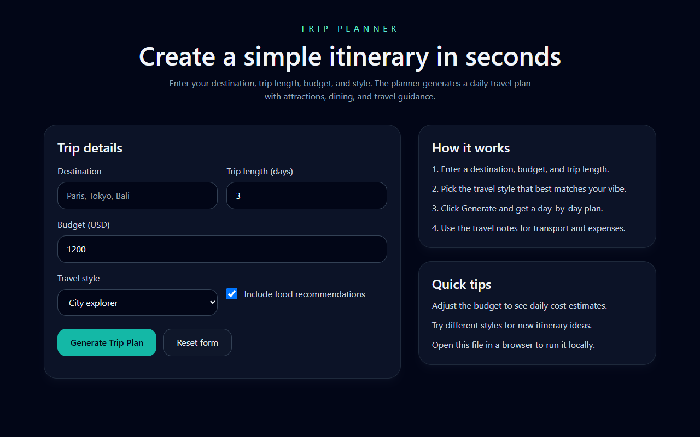
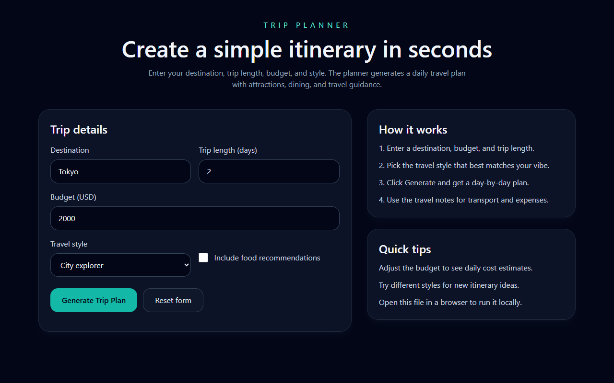
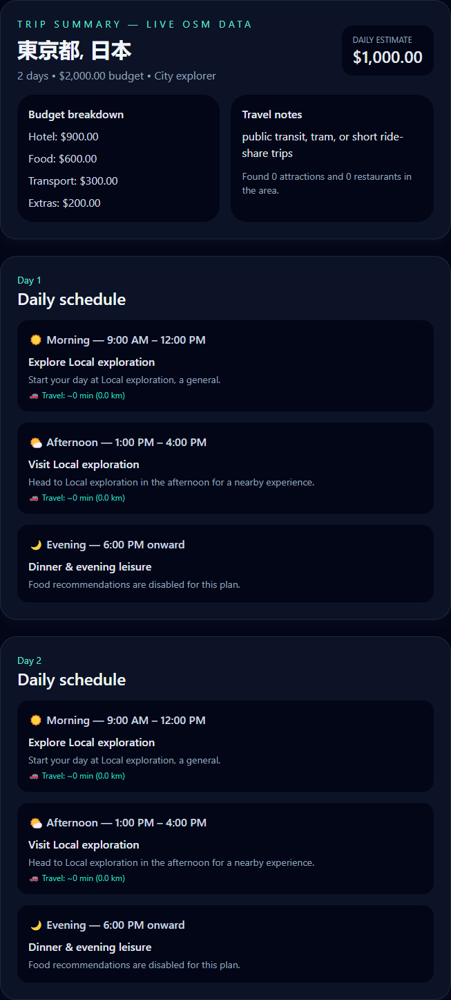

# ch-6 Personal Project — Report

## Project

- **GitHub username:** @susandarlin
- **Repo URL:** https://github.com/susandarlin/trip_planner
- **Live URL (deployed, public):** https://trip-planner-mu-taupe.vercel.app/
- **License:** MIT

## Issues Closed (from Chapter 5 feedback)

| # | Issue | Closed link | Fixed with (AI agent / MCP / skill) |
|---|---|---|---|
| 1 | Generic evenings — every day ended with "Dinner & evening leisure" instead of real restaurant names | [feedback.md #2](../../feedback/feedback.md) | `destination-agent` + OpenStreetMap MCP (`find_nearby_places`) to fetch restaurants; `schedule` agent + trip-planner skill rule #4 to put real names (or style-based cuisine fallbacks) in each evening slot |
| 2 | Slow loading UX — spinner only said "Generating…" with no progress | [feedback.md #4](../../feedback/feedback.md) | Frontend polish in `app.js`: step-by-step loading UI (`Looking up destination…` → attractions → budget → itinerary) while waiting on the generate API |

## Polish

- **UI/UX polish:** Added multi-step progress indicator during generation; evening slots now show real restaurant recommendations (or cuisine suggestions) instead of a generic placeholder
- **Chrome DevTools / Playwright used:** Yes — Chrome (headless via Puppeteer; Chrome DevTools MCP configured in `.mcp.json`) to capture polished UI screenshots at fixed resolution
- **README polished:** [README.md](../../README.md)
- **Analytics added:** None

## Updated Screenshots

- **Resolution used:** 1280×800 desktop

## Gallery Card (this project goes public)

- **Title:** Trip Planner
- **One-line description:** Live, data-driven trip plans powered by OpenStreetMap, Claude skills, and AI agents
- **Slides path:** slides/pitch.md
